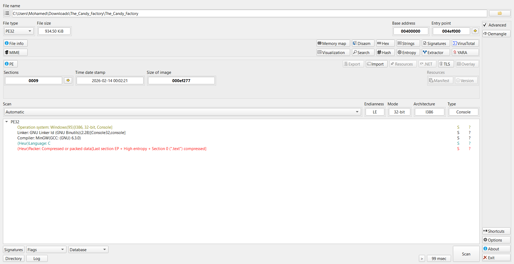
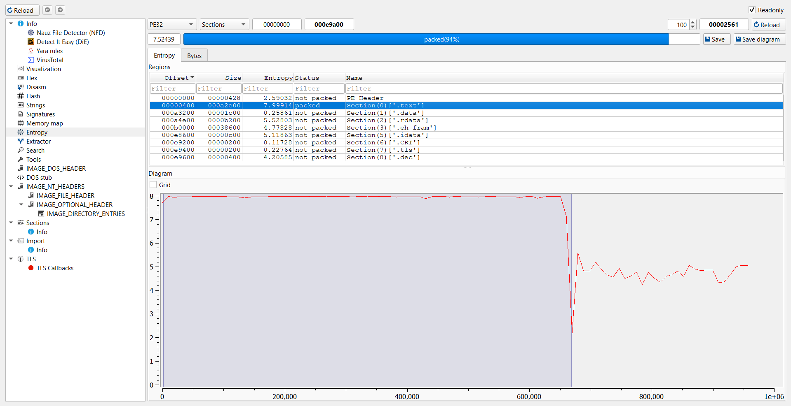
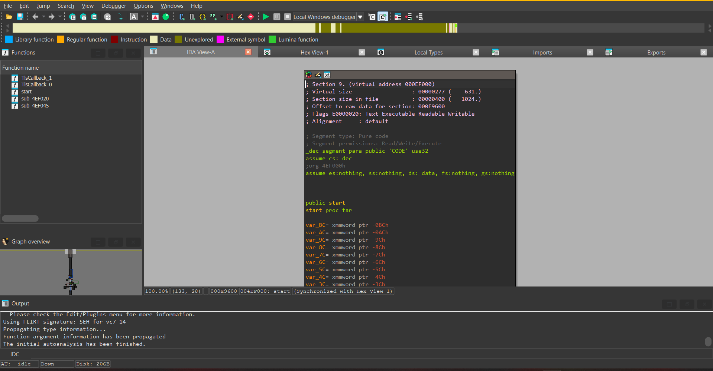
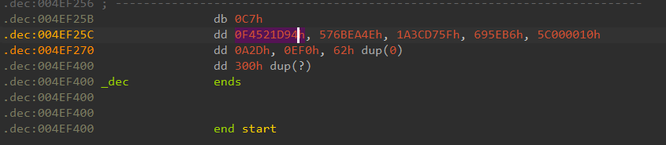
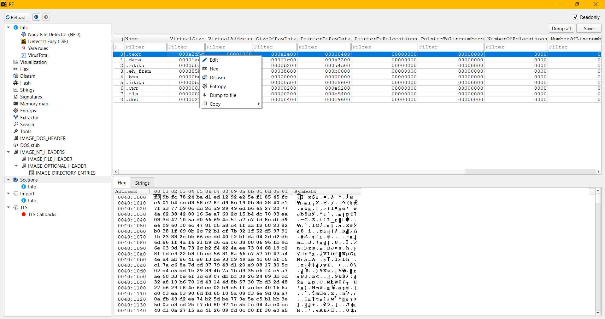

# The Candy Factory Writeup
**Description:**
Two young friends, lost in a frightening world not made for children.

If they cannot find a way out of this Nowhere place, they'll be condemned to a fate worse than death.

After escaping the monstrous grip of the Monster Baby in the Necropolis, Low and Alone discovered a fractured mirror hidden deep within the ruins. Desperate and with no path forward, they stepped through it. The mirror did not lead to freedom. It led to the Candy Factory where they encounter The supervisor.

The Factory's imposing authority figure. Her eternal vigilance can't make up for the gradual decline of an inert workforce.

The Supervisor falls beneath crushing steel, but the factory refuses to die. The machines continue their endless rhythm, and the exits remain sealed. Deep in the control room, Low and Alone discover a mechanism that demands a precise, logic-bound key. Though her body is gone, her will endures within the system — and only the correct sequence will unlock the gates.

**Authors:** [OTC](https://www.linkedin.com/in/mohamed-gharbi-a4196b325) x [Ad3M](https://ad3m.tech/)

**Attachment:**
[The Candy Factory](../Files/The_Candy_Factory.zip)

## Solution

We use `DIE` to know the type of our file:


It's a **32-bit Windows PE32 executable** compiled with **MinGW (GCC: GNU 6.3.0)** and linked using **GNU Binutils 2.28**. The binary is in **C** language and uses the **Console32** subsystem, targeting **i386 architecture** with **LE (Little Endian)** byte order.

Ironically, `DIE` detected high entropy for the `.text` section, which suggests that it's compressed or packed.

**Key Concepts:**
- **`.text` section**: The executable code section of a binary file (PE/ELF). This section contains the actual machine instructions that the CPU executes when the program runs.
- **Entropy**: A measure of randomness or unpredictability in data. In binary analysis, high entropy (close to 8.0) typically indicates encrypted, compressed, or packed data, as such transformations produce data that appears random.
- **Packer**: A tool that compresses or encrypts an executable to reduce its size or obfuscate its code. Packed binaries decompress themselves at runtime, making static analysis more difficult. Common packers include UPX, Themida, and VMProtect.

To investigate further, we navigate to the Entropy option in DIE:



The entropy analysis reveals critical information:
- The **`.text` section** (highlighted in blue) shows an extremely high entropy value of **7.39914**, indicating it's packed
- The top bar shows the overall file is **packed(94%)** with an entropy of **7.52439**
- The entropy diagram displays a dramatic visualization:
  - The graph maintains a consistent high entropy around **8.0** (maximum randomness) across most of the file
  - A sharp drop occurs around the 600,000 byte mark, where entropy plummets to approximately **2.0-5.0**
  - This characteristic pattern is typical of packed executables: high entropy compressed data followed by lower entropy unpacking stub or padding

The other sections (`.data`, `.rdata`, `.eh_fram`, etc.) show normal entropy values ranging from 0.11728 to 5.52803, confirming they are not packed. This asymmetry strongly indicates the use of a packer specifically targeting the executable code section.

Having analyzed the binary with DIE, we load the program **into** `IDA` to decompile it:



We can confirm that the `.text` section is packed when we navigate to it in IDA.

The `.text` section doesn't contain normal assembly instructions. Instead, IDA displays raw hexadecimal data defined as double-word (`dd`) values. This is characteristic of packed executables — rather than seeing recognizable x86 assembly mnemonics like `mov`, `push`, `call`, or `jmp`, we see sequences of seemingly random hexadecimal values:


```
.text:00401000 _text           segment para public 'CODE' use32
.text:00401000                 assume cs:_text
.text:00401000                 ;org 401000h
.text:00401000                 assume es:nothing, ss:nothing, ds:_data, fs:nothing, gs:nothing
.text:00401000                 dd 78FC9BF9h, 0EDD1BA24h, 5EE29212h, 0FC4585F1h, 0CCB401E6h
.text:00401014                 dd 8FE758D3h, 0B198CD9h, 0E140288Dh, 0B977A37Fh, 0A92CDC0Ch
.text:00401028                 dd 0B6ED4929h, 77202765h, 4238624Ah, 0A75E1680h, 0B4152C60h
.text:0040103C                 dd 0EA9370DCh, 10473D08h, 6966D05Ah, 0C7A75F4Ch, 0D9DF8EFDh
.text:00401050                 dd 106009E6h, 0F581476Ch, 0AA1FC4A8h, 822358F2h, 691F38B0h
.text:00401064                 dd 0B1722C0Bh, 1F927BCFh, 9197D552h, 2E8823FBh, 0DDCC66BBh
.text:00401078                 dd 0DABFF240h, 0DBD22D04h, 4A1F866Dh, 0D6B921F6h, 838F6CAh
.text:0040108C                 dd 9DFB9606h, 7A9D036Eh, 0F4B22C73h, 73EE4A42h, 0C2196804h
.text:004010A0                 dd 22E9FD8Fh, 56ECFBB8h, 0C7668A31h, 0A4477057h, 86ABA44Eh
.text:004010B4                 dd 0BE13E841h, 0AE49F993h, 155F684Ch, 8EC67AC1h, 7997CD7Dh
.text:004010C8                 dd 0E920D149h, 5C301708h, 0DDE5D402h, 4B39291Bh, 35D31B7Ah
.text:004010DC                 dd 0A7C5F4E6h, 0E3350AEh, 7C93C61h, 2639BFDBh, 0CD3B8924h
.text:004010F0                 dd 0B619A832h, 14431D70h, 30578B4Dh, 482DD37Bh, 0F829B627h
.text:00401104                 dd 2EE6D4Eh, 0ACFFE5B9h, 6A1640BEh, 3EA03C0h, 65FD6D90h
.text:00401118                 dd 0F3085A10h, 0A70A9D6Eh, 0D249FB0Ah, 5DB274EAh, 5E9E77BEh
.text:0040112C                 dd 3EBBB1C5h, 0CDC30A5Dh, 80DDF72Bh, 0FE5B1E97h, 0CCE04A04h
.text:00401140                 dd 270AD148h, 2641AC15h, 0F00CFD89h, 0A5E030FFh, 0D87ABF24h
.text:00401154                 dd 99E939F2h, 0B2751ECBh, 14857F97h, 4072E4CBh, 2B78AD1h
.text:00401168                 dd 0DA6972EAh, 0C96C202Fh, 29ABD97Bh, 0F1807726h, 0C6B0679Fh
.text:0040117C                 dd 9A3AFE85h, 1CB19329h, 7C3B87C6h, 0E4FA33D4h, 0D8B3B09Dh
.text:00401190                 dd 72CE80F7h, 4353263Dh, 0AC7B4F3Fh, 0FD199343h, 17D1C6E7h
.text:004011A4                 dd 10555836h, 0C9850D33h, 0A2ACF5D7h, 11A0E5ECh, 76FAE030h
.text:004011B8                 dd 0A3D5E44Dh, 0CF881073h, 680D4044h, 9C884148h, 49275E1Dh
.text:004011CC                 dd 0EA3FA9BBh, 40E7E739h, 0FA8B8062h, 0C5F10D6h, 0BDAF01DEh
.text:004011E0                 dd 0FFD56538h, 0CA8EBEB8h, 721D38FBh, 76EE43EFh, 95B0BA47h
.text:004011F4                 dd 771106DFh, 0B75DE0BDh, 5C9A2B91h, 0D6395A65h, 5AC0BCA2h
.text:00401208                 dd 91A5C7B9h, 63210E95h, 0C383597h, 6118DC80h, 0AD3BCC2Dh
.text:0040121C                 dd 0F9ED768Ah, 44E101ECh, 90D46BDh, 0F1C228B3h, 0EADB25C3h
.text:00401230                 dd 0F98F4CF7h, 0EAA44B5Ah, 5DEB9280h, 362BA6C0h, 0DFEFC3E6h
.text:00401244                 dd 0A958C391h, 0F7218E6h, 0A8B84050h, 5A24D0B7h, 9E9CADA8h
.text:00401258                 dd 2BD714DAh, 5613BD29h, 0D8AEB263h, 2A4BCDBDh, 0E051CA68h
.text:0040126C                 dd 6E8E16DCh, 0B18356A5h, 831103E1h, 950EC94Ch, 3A256A33h
.text:00401280                 dd 0F3C872B8h, 0CEE4A705h, 0C5F9592Bh, 8FA73003h
.text:00401290 ; ---------------------------------------------------------------------------
```

These hex bytes represent compressed or encrypted data that will be unpacked at runtime. IDA cannot disassemble this data into meaningful instructions because it's not in executable form yet, the actual code is hidden within this packed payload. The packer's stub code will decompress this data into memory when the program runs, revealing the true executable instructions.

After further navigation, we can notice something interesting:

```assembly
.dec:004EF000 _dec            segment para public 'CODE' use32
.dec:004EF000                 assume cs:_dec
.dec:004EF000                 ;org 4EF000h
.dec:004EF000                 assume es:nothing, ss:nothing, ds:_data, fs:nothing, gs:nothing
.dec:004EF000
.dec:004EF000 ; =============== S U B R O U T I N E =======================================
.dec:004EF000
.dec:004EF000
.dec:004EF000                 public start
.dec:004EF000 start           proc far
.dec:004EF000
.dec:004EF000 var_BC          = xmmword ptr -0BCh
.dec:004EF000 var_AC          = xmmword ptr -0ACh
.dec:004EF000 var_9C          = xmmword ptr -9Ch
.dec:004EF000 var_8C          = xmmword ptr -8Ch
.dec:004EF000 var_7C          = xmmword ptr -7Ch
.dec:004EF000 var_6C          = xmmword ptr -6Ch
.dec:004EF000 var_5C          = xmmword ptr -5Ch
.dec:004EF000 var_4C          = xmmword ptr -4Ch
.dec:004EF000 var_3C          = xmmword ptr -3Ch
.dec:004EF000 var_2C          = xmmword ptr -2Ch
.dec:004EF000
.dec:004EF000 ; FUNCTION CHUNK AT .text:00401292 SIZE 0000001C BYTES
.dec:004EF000 ; FUNCTION CHUNK AT .text:004012B0 SIZE 00000019 BYTES
.dec:004EF000 ; FUNCTION CHUNK AT .text:004012CE SIZE 0000000E BYTES
.dec:004EF000 ; FUNCTION CHUNK AT .text:004012E0 SIZE 00000082 BYTES
.dec:004EF000 ; FUNCTION CHUNK AT .text:00401379 SIZE 0000003A BYTES
.dec:004EF000 ; FUNCTION CHUNK AT .text:004013E6 SIZE 00000010 BYTES
.dec:004EF000 ; FUNCTION CHUNK AT .dec:004EF05C SIZE 000001FF BYTES
.dec:004EF000
.dec:004EF000                 push    eax
.dec:004EF001                 push    edi
.dec:004EF002                 push    esi
.dec:004EF003                 push    esp
.dec:004EF004                 push    edx
.dec:004EF005                 push    ecx
.dec:004EF006                 push    ebx
.dec:004EF007                 call    sub_4EF045
.dec:004EF00C                 sub     edx, 4Ah ; 'J'
.dec:004EF00F                 mov     ebx, edx
.dec:004EF011                 call    sub_4EF045
.dec:004EF016                 sub     edx, 0FFFFFDD7h
.dec:004EF01C                 sub     ebx, [edx]
.dec:004EF01E                 jmp     short loc_4EF05C
.dec:004EF01E start           endp ; sp-analysis failed
.dec:004EF01E
.dec:004EF020
.dec:004EF020 ; =============== S U B R O U T I N E =======================================
.dec:004EF020
.dec:004EF020
.dec:004EF020 sub_4EF020      proc near               ; CODE XREF: start+91↓p
.dec:004EF020                                         ; start+AD↓p ...
.dec:004EF020                 pshufd  xmm2, xmm2, 0FFh
.dec:004EF025                 vpslldq xmm3, xmm1, 4
.dec:004EF02A                 pxor    xmm1, xmm3
.dec:004EF02E                 vpslldq xmm3, xmm1, 4
.dec:004EF033                 pxor    xmm1, xmm3
.dec:004EF037                 vpslldq xmm3, xmm1, 4
.dec:004EF03C                 pxor    xmm1, xmm3
.dec:004EF040                 pxor    xmm1, xmm2
.dec:004EF044                 retn
.dec:004EF044 sub_4EF020      endp
.dec:004EF044
.dec:004EF045
.dec:004EF045 ; =============== S U B R O U T I N E =======================================
.dec:004EF045
.dec:004EF045
.dec:004EF045 sub_4EF045      proc near               ; CODE XREF: start+7↑p
.dec:004EF045                                         ; start+11↑p ...
.dec:004EF045                 call    $+5
.dec:004EF04A                 pop     edx
.dec:004EF04B                 retn
.dec:004EF04B sub_4EF045      endp
.dec:004EF04B
.dec:004EF04B ; ---------------------------------------------------------------------------
.dec:004EF04C aUnpacking      db '[Unpacking...]',0Ah,0
.dec:004EF05C ; ---------------------------------------------------------------------------
.dec:004EF05C ; START OF FUNCTION CHUNK FOR start
.dec:004EF05C
.dec:004EF05C loc_4EF05C:                             ; CODE XREF: start+1E↑j
.dec:004EF05C                 call    sub_4EF045
.dec:004EF061                 sub     edx, 0FFFFFDDFh
.dec:004EF067                 mov     eax, [edx]
.dec:004EF069                 add     eax, ebx
.dec:004EF06B                 call    sub_4EF045
.dec:004EF070                 sub     edx, 0FFFFFDEFh
.dec:004EF076                 movdqu  xmm1, xmmword ptr [edx]
.dec:004EF07A                 call    sub_4EF045
.dec:004EF07F                 sub     edx, 0FFFFFDDBh
.dec:004EF085                 mov     edx, [edx]
.dec:004EF087                 movdqu  xmm0, xmm1
.dec:004EF08B                 aeskeygenassist xmm2, xmm1, 1
.dec:004EF091                 call    sub_4EF020
.dec:004EF096                 movdqu  xmm4, xmm1
.dec:004EF09A                 aesimc  xmm4, xmm4
.dec:004EF09F                 sub     esp, 10h
.dec:004EF0A2                 movdqu  [esp+2Ch+var_2C], xmm4
.dec:004EF0A7                 aeskeygenassist xmm2, xmm1, 2
.dec:004EF0AD                 call    sub_4EF020
.dec:004EF0B2                 movdqu  xmm4, xmm1
.dec:004EF0B6                 aesimc  xmm4, xmm4
.dec:004EF0BB                 sub     esp, 10h
.dec:004EF0BE                 movdqu  [esp+3Ch+var_3C], xmm4
.dec:004EF0C3                 aeskeygenassist xmm2, xmm1, 4
.dec:004EF0C9                 call    sub_4EF020
.dec:004EF0CE                 movdqu  xmm4, xmm1
.dec:004EF0D2                 aesimc  xmm4, xmm4
.dec:004EF0D7                 sub     esp, 10h
.dec:004EF0DA                 movdqu  [esp+4Ch+var_4C], xmm4
.dec:004EF0DF                 aeskeygenassist xmm2, xmm1, 8
.dec:004EF0E5                 call    sub_4EF020
.dec:004EF0EA                 movdqu  xmm4, xmm1
.dec:004EF0EE                 aesimc  xmm4, xmm4
.dec:004EF0F3                 sub     esp, 10h
.dec:004EF0F6                 movdqu  [esp+5Ch+var_5C], xmm4
.dec:004EF0FB                 aeskeygenassist xmm2, xmm1, 10h
.dec:004EF101                 call    sub_4EF020
.dec:004EF106                 movdqu  xmm4, xmm1
.dec:004EF10A                 aesimc  xmm4, xmm4
.dec:004EF10F                 sub     esp, 10h
.dec:004EF112                 movdqu  [esp+6Ch+var_6C], xmm4
.dec:004EF117                 aeskeygenassist xmm2, xmm1, 20h ; ' '
.dec:004EF11D                 call    sub_4EF020
.dec:004EF122                 movdqu  xmm4, xmm1
.dec:004EF126                 aesimc  xmm4, xmm4
.dec:004EF12B                 sub     esp, 10h
.dec:004EF12E                 movdqu  [esp+7Ch+var_7C], xmm4
.dec:004EF133                 aeskeygenassist xmm2, xmm1, 40h ; '@'
.dec:004EF139                 call    sub_4EF020
.dec:004EF13E                 movdqu  xmm4, xmm1
.dec:004EF142                 aesimc  xmm4, xmm4
.dec:004EF147                 sub     esp, 10h
.dec:004EF14A                 movdqu  [esp+8Ch+var_8C], xmm4
.dec:004EF14F                 aeskeygenassist xmm2, xmm1, 80h
.dec:004EF155                 call    sub_4EF020
.dec:004EF15A                 movdqu  xmm4, xmm1
.dec:004EF15E                 aesimc  xmm4, xmm4
.dec:004EF163                 sub     esp, 10h
.dec:004EF166                 movdqu  [esp+9Ch+var_9C], xmm4
.dec:004EF16B                 aeskeygenassist xmm2, xmm1, 1Bh
.dec:004EF171                 call    sub_4EF020
.dec:004EF176                 movdqu  xmm4, xmm1
.dec:004EF17A                 aesimc  xmm4, xmm4
.dec:004EF17F                 sub     esp, 10h
.dec:004EF182                 movdqu  [esp+0ACh+var_AC], xmm4
.dec:004EF187                 aeskeygenassist xmm2, xmm1, 36h ; '6'
.dec:004EF18D                 call    sub_4EF020
.dec:004EF192                 movdqu  xmm4, xmm1
.dec:004EF196                 sub     esp, 10h
.dec:004EF199                 movdqu  [esp+0BCh+var_BC], xmm4
.dec:004EF19E                 xor     ecx, ecx
.dec:004EF1A0                 sub     edx, 10h
.dec:004EF1A3
.dec:004EF1A3 loc_4EF1A3:                             ; CODE XREF: start+244↓j
.dec:004EF1A3                 movdqu  xmm1, xmm0
.dec:004EF1A7                 movdqu  xmm7, xmmword ptr [eax+ecx]
.dec:004EF1AC                 movdqu  xmm4, [esp+0BCh+var_BC]
.dec:004EF1B1                 add     esp, 10h
.dec:004EF1B4                 pxor    xmm7, xmm4
.dec:004EF1B8                 movdqu  xmm4, [esp+0ACh+var_AC]
.dec:004EF1BD                 add     esp, 10h
.dec:004EF1C0                 aesdec  xmm7, xmm4
.dec:004EF1C5                 movdqu  xmm4, [esp+9Ch+var_9C]
.dec:004EF1CA                 add     esp, 10h
.dec:004EF1CD                 aesdec  xmm7, xmm4
.dec:004EF1D2                 movdqu  xmm4, [esp+8Ch+var_8C]
.dec:004EF1D7                 add     esp, 10h
.dec:004EF1DA                 aesdec  xmm7, xmm4
.dec:004EF1DF                 movdqu  xmm4, [esp+7Ch+var_7C]
.dec:004EF1E4                 add     esp, 10h
.dec:004EF1E7                 aesdec  xmm7, xmm4
.dec:004EF1EC                 movdqu  xmm4, [esp+6Ch+var_6C]
.dec:004EF1F1                 add     esp, 10h
.dec:004EF1F4                 aesdec  xmm7, xmm4
.dec:004EF1F9                 movdqu  xmm4, [esp+5Ch+var_5C]
.dec:004EF1FE                 add     esp, 10h
.dec:004EF201                 aesdec  xmm7, xmm4
.dec:004EF206                 movdqu  xmm4, [esp+4Ch+var_4C]
.dec:004EF20B                 add     esp, 10h
.dec:004EF20E                 aesdec  xmm7, xmm4
.dec:004EF213                 movdqu  xmm4, [esp+3Ch+var_3C]
.dec:004EF218                 add     esp, 10h
.dec:004EF21B                 aesdec  xmm7, xmm4
.dec:004EF220                 movdqu  xmm4, [esp+2Ch+var_2C]
.dec:004EF225                 add     esp, 10h
.dec:004EF228                 aesdec  xmm7, xmm4
.dec:004EF22D                 aesdeclast xmm7, xmm0
.dec:004EF232                 movdqu  xmmword ptr [eax+ecx], xmm7
.dec:004EF237                 sub     esp, 0A0h
.dec:004EF23D                 add     ecx, 10h
.dec:004EF240                 cmp     edx, ecx
.dec:004EF242                 jle     short loc_4EF249
.dec:004EF244                 jmp     loc_4EF1A3
.dec:004EF249 ; ---------------------------------------------------------------------------
.dec:004EF249
.dec:004EF249 loc_4EF249:                             ; CODE XREF: start+242↑j
.dec:004EF249                 add     esp, 0A0h
.dec:004EF24F                 pop     ebx
.dec:004EF250                 pop     ecx
.dec:004EF251                 pop     edx
.dec:004EF252                 pop     esp
.dec:004EF253                 pop     esi
.dec:004EF254                 pop     edi
.dec:004EF255                 pop     eax
.dec:004EF256                 jmp     loc_4012E0
.dec:004EF256 ; END OF FUNCTION CHUNK FOR start
.dec:004EF256 ; ---------------------------------------------------------------------------
.dec:004EF25B                 db 0C7h
.dec:004EF25C                 dd 0F4521D94h, 576BEA4Eh, 1A3CD75Fh, 695EB6h, 5C000010h
.dec:004EF270                 dd 0A2Dh, 0EF0h, 62h dup(0)
.dec:004EF400                 dd 300h dup(?)
.dec:004EF400 _dec            ends
.dec:004EF400
.dec:004EF400
.dec:004EF400                 end start
```

After further navigation, we discover a `.dec` section containing the unpacking stub. Analysis of the assembly code reveals that the `.text` section is encrypted using **AES-128 in ECB mode**. Here's the evidence:

**1. AES-NI Instructions Usage:**

The code uses Intel's AES-NI (AES New Instructions) hardware acceleration instructions:

```assembly
.dec:004EF08B                 aeskeygenassist xmm2, xmm1, 1    ; AES key generation
.dec:004EF09A                 aesimc  xmm4, xmm4               ; Inverse MixColumns transformation
.dec:004EF1C0                 aesdec  xmm7, xmm4               ; AES single round decryption
.dec:004EF22D                 aesdeclast xmm7, xmm0            ; AES last round decryption
```

These are cryptographic-specific instructions that only appear in AES implementations.

**2. AES-128 Key Expansion (10 Rounds):**

The code performs key expansion with round constants characteristic of AES-128:

```assembly
.dec:004EF08B                 aeskeygenassist xmm2, xmm1, 1    ; Round 1
.dec:004EF0A7                 aeskeygenassist xmm2, xmm1, 2    ; Round 2
.dec:004EF0C3                 aeskeygenassist xmm2, xmm1, 4    ; Round 3
.dec:004EF0DF                 aeskeygenassist xmm2, xmm1, 8    ; Round 4
.dec:004EF0FB                 aeskeygenassist xmm2, xmm1, 10h  ; Round 5
.dec:004EF117                 aeskeygenassist xmm2, xmm1, 20h  ; Round 6
.dec:004EF133                 aeskeygenassist xmm2, xmm1, 40h  ; Round 7
.dec:004EF14F                 aeskeygenassist xmm2, xmm1, 80h  ; Round 8
.dec:004EF16B                 aeskeygenassist xmm2, xmm1, 1Bh  ; Round 9
.dec:004EF187                 aeskeygenassist xmm2, xmm1, 36h  ; Round 10
```

The values {1, 2, 4, 8, 0x10, 0x20, 0x40, 0x80, 0x1B, 0x36} are the exact AES round constants (Rcon) for AES-128, which requires 10 rounds. This confirms 128-bit key length (AES-192 uses 12 rounds, AES-256 uses 14 rounds).

**3. ECB Mode Detection:**

The decryption loop processes data in independent 16-byte blocks without chaining:

```assembly
.dec:004EF1A3 loc_4EF1A3:                             ; Decryption loop
.dec:004EF1A3                 movdqu  xmm1, xmm0               ; Load initial key
.dec:004EF1A7                 movdqu  xmm7, xmmword ptr [eax+ecx]  ; Load 16-byte block
.dec:004EF1AC                 movdqu  xmm4, [esp+0BCh+var_BC]  ; First round key
.dec:004EF1B4                 pxor    xmm7, xmm4               ; XOR with round key
.dec:004EF1C0                 aesdec  xmm7, xmm4               ; Decrypt round 1
.dec:004EF1CD                 aesdec  xmm7, xmm4               ; Decrypt round 2
...
.dec:004EF228                 aesdec  xmm7, xmm4               ; Decrypt round 9
.dec:004EF22D                 aesdeclast xmm7, xmm0            ; Final round
.dec:004EF232                 movdqu  xmmword ptr [eax+ecx], xmm7  ; Store decrypted block
.dec:004EF23D                 add     ecx, 10h                 ; Move to next 16-byte block
.dec:004EF240                 cmp     edx, ecx
.dec:004EF242                 jle     short loc_4EF249
.dec:004EF244                 jmp     loc_4EF1A3               ; Loop
```

**Key indicators of ECB mode:**

- Each block is decrypted independently (no XOR with previous ciphertext)
- The counter increments by 0x10 (16 bytes) each iteration
- No chaining between blocks, each block uses the same initial key xmm0
- Notice that xmm1 is reloaded with xmm0 at the start of each loop iteration

This is **Electronic Codebook (ECB) mode**, where identical plaintext blocks produce identical ciphertext blocks.

**4. 128-bit Block Size:**

The loop processes data in 16-byte (128-bit) chunks:

```assembly
.dec:004EF23D                 add     ecx, 10h                 ; Increment by 16 bytes
```

This is the standard AES block size.

This provides concrete assembly-level proof for each claim about the encryption scheme.This provides concrete assembly-level proof for each claim about the encryption scheme.

Having known the encryption algorithm of `.text` section, we can write a Python script to decrypt it. But first, we need to extract the AES key.

### Extracting the AES Key

The key extraction is straightforward by analyzing the unpacking stub. The AES key is loaded into the `xmm1` register before the key expansion begins:

```assembly
.dec:004EF06B                 call    sub_4EF045               ; Get current position
.dec:004EF070                 sub     edx, 0FFFFFDEFh          ; Calculate key offset
.dec:004EF076                 movdqu  xmm1, xmmword ptr [edx]  ; Load 128-bit AES key
```

The sub_4EF045 subroutine is a position-independent code (PIC) technique that retrieves the current instruction pointer:

```assembly
.dec:004EF045 sub_4EF045      proc near
.dec:004EF045                 call    $+5                      ; Push return address (EIP)
.dec:004EF04A                 pop     edx                      ; EDX = current position
.dec:004EF04B                 retn
.dec:004EF045 sub_4EF045      endp
```

After the call at **.dec:004EF06B**, **edx = 0x004EF04A** (from sub_4EF045's internal `call $+5` mechanism, which pushes the address of the next instruction at 0x004EF04A). Then:

- **edx = 0x004EF04A - 0xFFFFFDEF = 0x004EF04A + 0x211 = 0x004EF25B**

Navigating to address 0x004EF25B in IDA reveals the hardcoded AES key:



The 16-byte (128-bit) AES key stored at this location is:

```
Key bytes at 0x004EF25B:
C7 94 1D 52 F4 4E EA 6B 57 5F D7 3C 1A B6 5E 69
```

Or in hexadecimal notation:

```AES Key: C7941D52F44EEA6B575FD73C1AB65E69```

We can verify this by examining the data section in IDA:

```assembly
.dec:004EF25B                 db 0C7h
.dec:004EF25C                 db 94h, 1Dh, 52h, 0F4h, 4Eh, 0EAh, 6Bh, 57h
.dec:004EF264                 db 5Fh, 0D7h, 3Ch, 1Ah, 0B6h, 5Eh, 69h
```

### Decrypting the `.text` Section

Now that we have the AES key, we can write a Python script to decrypt the encrypted `.text` section.

First, we need to extract the encrypted `.text` section from the binary. Using **DIE**, this is straightforward:

1. Navigate to the **Sections** tab
2. Right-click on the `.text` section
3. Select **Dump to file**
4. Save it



With the encrypted section dumped, we can now decrypt it using Python:

```python
from Crypto.Cipher import AES

key = bytes.fromhex('C7941D52F44EEA6B575FD73C1AB65E69')

with open('text_section_encrypted.bin', 'rb') as f:
    encrypted_data = f.read()

cipher = AES.new(key, AES.MODE_ECB)

decrypted_data = cipher.decrypt(encrypted_data)

with open('text_section_decrypted.bin', 'wb') as f:
    f.write(decrypted_data)

print(f"Decrypted {len(decrypted_data)} bytes")
print(f"Output saved to: text_section_decrypted.bin")
```

Running this script:
```bash
hamoudi@Mohamed:/mnt/c/Users/Mohamed/Downloads/The_Candy_Factory$ python3 decrypt.py
Decrypted 667136 bytes
Output saved to: text_section_decrypted.bin
```

Now we need to patch the binary to replace the encrypted `.text` section with our decrypted version and remove the `.dec` unpacking stub:

```python
#!/usr/bin/env python3
import struct

data = bytearray(open('The_Candy_Factory', 'rb').read())
dec_text = open('The_Candy_Factory_decrypted.bin', 'rb').read()

e_lfanew = struct.unpack_from('<I', data, 0x3C)[0]
coff = e_lfanew + 4
opt = coff + 20
opt_sz = struct.unpack_from('<H', data, coff + 16)[0]
img_base = struct.unpack_from('<I', data, opt + 28)[0]
sec_base = opt + opt_sz

text_off = text_sz = dec_hdr = dec_off = dec_sz = dec_va = None

for i in range(struct.unpack_from('<H', data, coff + 2)[0]):
    o = sec_base + i * 40
    name = data[o:o+8].rstrip(b'\x00').decode('ascii', 'replace')
    if name == '.text':
        text_off = struct.unpack_from('<I', data, o + 20)[0]
        text_sz = struct.unpack_from('<I', data, o + 16)[0]
    elif name == '.dec':
        dec_hdr = o
        dec_off = struct.unpack_from('<I', data, o + 20)[0]
        dec_sz = struct.unpack_from('<I', data, o + 16)[0]
        dec_va = struct.unpack_from('<I', data, o + 12)[0]

data[text_off:text_off + text_sz] = dec_text

data[dec_hdr:dec_hdr + 40] = b'\x00' * 40
data[dec_off:dec_off + dec_sz] = b'\x00' * dec_sz

struct.pack_into('<H', data, coff + 2, struct.unpack_from('<H', data, coff + 2)[0] - 1)

if data[dec_off + 0x256] == 0xe9:
    rel32 = struct.unpack_from('<i', data, dec_off + 0x257)[0]
    oep_rva = (img_base + dec_va + 0x25B + rel32 - img_base) & 0xFFFFFFFF
    struct.pack_into('<I', data, opt + 16, oep_rva)

open('The_Candy_Factory_unpacked.exe', 'wb').write(data)
print("Unpacked!")
```

Running this script will output:

```bash
hamoudi@Mohamed:/mnt/c/Users/Mohamed/Downloads/The_Candy_Factory$ python3 unpack.py
Unpacked!
```
Analyzing the Unpacked Binary
Now we can load `The_Candy_Factory_unpacked.exe` into IDA and analyze the main function. The decompiled code reveals several key components:

## **1. Anti-Debugging Mechanisms**

The program implements multiple anti-debugging checks at startup:

```c++
v145 = IsDebuggerPresent();
if ( v145 )
  exit(3);

pbDebuggerPresent = 0;
CurrentProcess = GetCurrentProcess();
if ( CheckRemoteDebuggerPresent(CurrentProcess, &pbDebuggerPresent) && pbDebuggerPresent )
  exit(4);
```

The binary uses two techniques:

* **IsDebuggerPresent()**: Detects if a debugger is attached to the current process
* **CheckRemoteDebuggerPresent()**: Detects remote debugging sessions

If either check detects a debugger, the program terminates immediately.

These checks are user-mode only and can be bypassed via patching or debugger hiding.

---

## **2. Flag Input and Length Validation**

The program accepts input either via command-line argument or stdin:

```c++
if ( v2 <= 1 )
{
  sub_499840((int)&dword_4A5780, "Enter Flag: ");
  sub_496CC0(&dword_4A55A0, &v179);
}
else
{
  sub_489500(*(char **)(v3 + 4));
}

if ( v180 != 33 )
  exit(0);
```

**Critical observation:** The flag must be exactly **33 characters long**.
Any other length causes immediate termination.

This already hints at the format:

```
Securinets{................}
```

---

## **3. PBKDF2 Key Derivation (Not Custom AES Rounds)**

Initially, the loop that runs 9999 times appears to be a custom AES mixing routine:

```c++
v7 = 9999;
do
{
  sub_401E50(v186);
  ...
  --v7;
}
while ( v7 );
```

However, deeper analysis shows that:

* `sub_401E50` is **HMAC-MD5**, not an AES round.
* The constants inside match:

  * `0x36363636` (ipad)
  * `0x5c5c5c5c` (opad)
  * MD5 IV:

    * `0x67452301`
    * `0xEFCDAB89`
    * `0x98BADCFE`
    * `0x10325476`

This loop is actually implementing **PBKDF2-HMAC-MD5 with 10,000 iterations** (9999 loop iterations + initial round).

---

### XOR-Decoded Secret

A 24-byte buffer in `.rdata` is XORed with `0x42`, revealing:

```
D4rk3stHouuur_$(secret)\x00
```

This string is **NOT directly the AES key**.

Instead, it is used as part of the **PBKDF2 password**.

---

### PBKDF2 Parameters

* Password:
  `"D4rk3stHouuur_$(secret)\x00" + "Securine"`
* Salt: `"Securine"`
* Iterations: 10,000
* Hash: MD5
* Output length: 16 bytes

This derives the AES-128 key:

```
671a72f400729fe4fd94f07c4914eb33
```

---

## **4. AES-128-ECB Verification**

After PBKDF2, the program performs **AES-128-ECB encryption**.

### Important Correction:

It does **NOT** encrypt the first 8 bytes.
It encrypts **flag[8:24]** (16 bytes, one full AES block).

The S-Box at `0x004A6D60` is the **standard AES S-box**, and the implementation performs the normal 10 AES rounds (AES-128).

The result is compared against the hardcoded ciphertext:

```
583e97e2177d8d4f9cc2548eb4d8996c
```

Decrypting this block gives:

```
ts{Sw33t5_f0r_my
```

So we reconstruct:

```
Securinets{Sw33t5_f0r_my????????}
```

---

## **5. MD5 Hash Verification**

After the AES check passes, the program performs a standard MD5 hash.

```c++
pbDebuggerPresent = 1732584193;
v188 = -271733879;
v189 = -1732584194;
v190 = 271733878;
```

These are the standard MD5 IV constants:

* `0x67452301`
* `0xEFCDAB89`
* `0x98BADCFE`
* `0x10325476`

### Important Correction:

It does **NOT** hash bytes 9–33 (24 bytes).
It hashes only **flag[24:33]** (9 bytes).

The target digest reconstructed from the XOR comparisons is:

```
cfb710a87b8d38ff9c0e4aa4d01424a4
```

Brute-forcing the final 9 bytes consistent with the theme
“Sweets for my sweet” (leet style) gives:

```
_5w33t!!}
```

Which satisfies:

```
MD5("_5w33t!!}") = cfb710a87b8d38ff9c0e4aa4d01424a4
```

---

## **6. Final Verification and Success Banner**

Final comparison:

```c++
v135 = v129 ^ 0xA42414D0 | v130 ^ 0xA44A0E9C |
       v131 ^ 0xFF388D7B | v175 ^ 0xA810B7CF;

if ( HIBYTE(v135) | (unsigned __int8)
     (BYTE2(v135) | BYTE1(v135) | v135 |
      v159 | v166 | v167 | v168) )
{
  v145 = 1;  // Incorrect flag
}
else
{
  sub_4958B0(&dword_4A5780,
    "\n[ASCII ART OF LOW CHARACTER]...", 3204);
  sub_496B90(&dword_4A5780);
}
```

**Success condition:**
All XOR comparisons must evaluate to zero.

That means:

* AES-ECB(flag[8:24]) == expected ciphertext
* MD5(flag[24:33]) == expected digest

When both checks pass, the program prints the `LOW` ASCII art banner.

Now that we understand the encryption of the flag, let's write the Python solver:

```python
import hashlib
from Crypto.Cipher import AES

XOR_KEY = b"D4rk3stHouuur_$(secret)\x00"
AES_CIPHERTEXT = bytes.fromhex("583e97e2177d8d4f9cc2548eb4d8996c")
MD5_TARGET = "cfb710a87b8d38ff9c0e4aa4d01424a4"

PREFIX = b"Securine"

def derive_key():
    return hashlib.pbkdf2_hmac(
        'md5',
        XOR_KEY + PREFIX,
        PREFIX,
        10_000,
        dklen=16
    )

def decrypt_middle(aes_key):
    cipher = AES.new(aes_key, AES.MODE_ECB)
    return cipher.decrypt(AES_CIPHERTEXT)

def crack_suffix():
    charset = "abcdefghijklmnopqrstuvwxyzABCDEFGHIJKLMNOPQRSTUVWXYZ0123456789_!"
    prefixes = [
        "_5w33t", "_Sw33t", "_sw33t", "_SW33T"
    ]

    for pfx in prefixes:
        for c1 in charset:
            for c2 in charset:
                candidate = (pfx + c1 + c2 + "}").encode()
                if hashlib.md5(candidate).hexdigest() == MD5_TARGET:
                    return candidate

    return None

def main():
    print("Deriving AES key...")
    aes_key = derive_key()
    print(f"AES key: {aes_key.hex()}")

    print("Decrypting middle block...")
    middle = decrypt_middle(aes_key)
    print(f"Middle plaintext: {middle.decode()}")

    print("Cracking suffix...")
    suffix = crack_suffix()
    print(f"Suffix: {suffix.decode()}")

    flag = PREFIX.decode() + middle.decode() + suffix.decode()
    
    print("FLAG:", flag)


if __name__ == "__main__":
    main()
```

Running our solver will give us the flag:

```bash
hamoudi@Mohamed:/mnt/c/Users/Mohamed/Downloads/The_Candy_Factory$ python3 solver.py
Deriving AES key...
AES key: 671a72f400729fe4fd94f07c4914eb33
Decrypting middle block...
Middle plaintext: ts{Sw33t5_f0r_my
Cracking suffix...
Suffix: _5w33t!!}
FLAG: Securinets{Sw33t5_f0r_my_5w33t!!}
```

And here we are, let's test it now in the binary:

```bash
hamoudi@Mohamed:/mnt/c/Users/Mohamed/Downloads/The_Candy_Factory$ ./The_Candy_Factory
Enter Flag: Securinets{Sw33t5_f0r_my_5w33t!!}


                                            +++++
                                           +++++++#  ++++
                                 +++       +++++++++++++++*
                                +++++*    ++++++++++++++++*+++*
                                ++++++++++++++++++++++++++++++++ +++++#
                                 ++++++++++++++++++++++++++++++++++++*#
                                 *+++++++++++++++++++++++++++++++++++#
                                ++++++++++++++++++++++++++++++++++++#
                                ++++++++++++++++++++++++++++++++++++++++++*
                          +++++++++++++++++++++++++++++++++++++++++++++++*#
                          +++++++++++++++++++++++++++++++++++++++++++++*#
                           ++++++++++++++++++++++++++++++++++++++++++*
                            *++++++++++++******++++++++*****++++++++++#
                              ++++++++*#          **#         +++++++++
                              +++++++*                         ++++++++++
                               ++++++# +++++++          +++++*  ++++++++*#
                              ++++++*# ++++++++        +++++++% +++++*#%
                              +++++++* *++++++*       ++++*#    +++++#
                                  ++++*  ****#         ##      +++++#
                                   #*+++*                   ++++*##
                                     ++++++++++        ++++++++*#
                                         ***#**+#     +*  ***#
                                               ++*   ++#
                                                ++# ++#
                                                 ++++*
                                                  *##


```

And this is our flag at the end:

    Securinets{Sw33t5_f0r_my_5w33t!!}

That’s it for the Darkest Hour CTF challenge. I would like to thank everyone who took the time to play, solve, and provide feedback, we truly appreciate your effort and support.

A special shout-out to `Ad3M`, who co-authored this task with me. It was a pleasure designing and building this challenge together!

And here is a sweet for you, my sweet:


